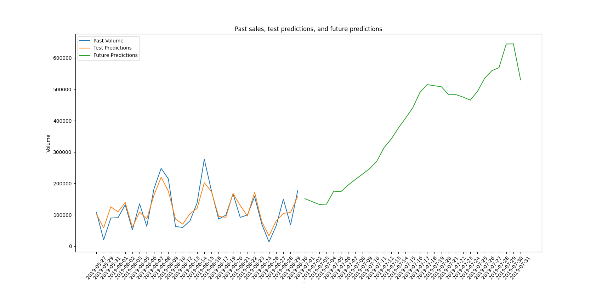

## Sales Forecast

|    | Date       |   Predicted Volume |
|---:|:-----------|-------------------:|
|  0 | 2019-07-01 |             144620 |
|  1 | 2019-07-02 |             147335 |
|  2 | 2019-07-03 |             154809 |
|  3 | 2019-07-04 |             162141 |
|  4 | 2019-07-05 |             176309 |
|  5 | 2019-07-06 |             177468 |
|  6 | 2019-07-07 |             184272 |
|  7 | 2019-07-08 |             191188 |
|  8 | 2019-07-09 |             195635 |
|  9 | 2019-07-10 |             202772 |
| 10 | 2019-07-11 |             205639 |
| 11 | 2019-07-12 |             203887 |
| 12 | 2019-07-13 |             194576 |
| 13 | 2019-07-14 |             236172 |
| 14 | 2019-07-15 |             258234 |
| 15 | 2019-07-16 |             255179 |
| 16 | 2019-07-17 |             276271 |
| 17 | 2019-07-18 |             276067 |
| 18 | 2019-07-19 |             282917 |
| 19 | 2019-07-20 |             276860 |
| 20 | 2019-07-21 |             273186 |
| 21 | 2019-07-22 |             277458 |
| 22 | 2019-07-23 |             288742 |
| 23 | 2019-07-24 |             291569 |
| 24 | 2019-07-25 |             299332 |
| 25 | 2019-07-26 |             290915 |
| 26 | 2019-07-27 |             285843 |
| 27 | 2019-07-28 |             326650 |
| 28 | 2019-07-29 |             413746 |
| 29 | 2019-07-30 |             439342 |
| 30 | 2019-07-31 |             447798 |